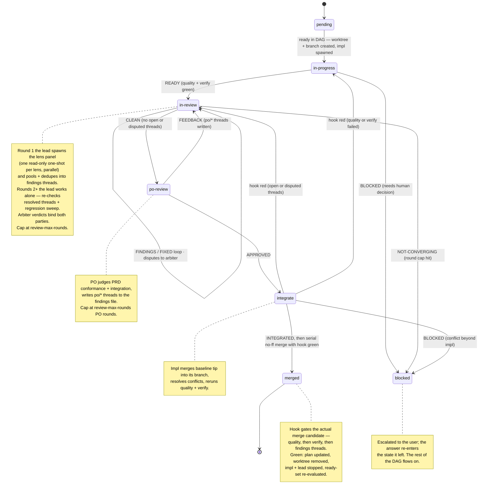

# Per-Issue Lifecycle, Findings Threads & Message Protocol

## Findings file (the source of truth)

One file per issue at `.scratch/<slug>/findings-<n>.md` in the baseline worktree. Every blocking finding — review or product-owner — is a **thread**; the merge gate blocks while any thread is `open` or `disputed`. Messages between teammates are thin notifications; this file is the record.

```
## F<id> [<state>] <tag>
<one-line summary — file:line>
<rationale / detail>
fix: <sha>                        ← implementer, on resolve
dispute: <rationale>              ← implementer, on dispute
arbiter: <upheld|dropped — why>   ← review lead, after arbitration
```

- **States**: `open` → `resolved` (implementer, with `fix:` sha) | `disputed` (implementer, with `dispute:` rationale) → `open`/`dropped` (arbiter verdict). The lead may **reopen** a `resolved` thread the fix didn't actually fix; the PO may reopen its own.
- **Tags**: the lens that found it (`correctness`, `security`, …) or `po/prd-gap`, `po/integration`.
- **Writers**: the review lead creates review threads and records arbiter verdicts; the implementer only resolves or disputes; the PO creates and re-judges `po/*` threads. Nobody deletes threads.
- The review lead creates the file even when the panel finds nothing — the merge gate treats a **missing file as a failed gate** (unreviewed code).

## Message protocol

Teammates and the orchestrator coordinate with `SendMessage`. Every message starts with a signal token so the receiver can route it.

| From → To             | Signal                  | Meaning                                              |
| --------------------- | ----------------------- | ---------------------------------------------------- |
| impl → orchestrator   | `READY`                 | `/tdd` finished; quality + verify green; review me   |
| impl → orchestrator   | `INTEGRATED`            | branch brought up to baseline, quality + verify pass |
| impl → orchestrator   | `BLOCKED: <question>`   | genuine blocker; needs a human decision              |
| lead → impl           | `FINDINGS`              | new open threads written to the findings file        |
| impl → lead           | `FIXED`                 | threads resolved in the file; please re-review       |
| impl → lead           | `DISPUTE: F<id> <why>`  | thread contested; please arbitrate                   |
| lead → orchestrator   | `CLEAN`                 | no open or disputed threads remain                   |
| lead → orchestrator   | `NOT-CONVERGING: <…>`   | review-round cap hit; threads still open             |
| lead → orchestrator   | `BLOCKED: <problem>`    | cannot review as planned (e.g. lens not in catalog)  |
| orchestrator → po     | `REVIEW: <#> <branch>`  | review this issue against the PRD                    |
| po → orchestrator     | `APPROVED: <#>`         | meets the PRD and integrates cleanly                 |
| po → orchestrator     | `FEEDBACK: <#>`         | `po/*` threads written to the findings file          |
| orchestrator → impl   | `FEEDBACK`              | PO threads to address; re-enter the loop             |
| orchestrator → impl   | `INTEGRATE`             | bring branch up to baseline tip, resolve, verify     |

## DAG dispatch

- The plan's `Blocked by` edges are the schedule. A node is **ready** when all its blockers are done (`merged` issues, `done` checkpoints). Dispatch ready issues as slots free up under the parallelism cap, in plan order.
- **Scoped checkpoints** dam only their dependents; **barrier checkpoints** end the segment — nothing past them dispatches until done.
- **Manual issues** are ordinary nodes whose implementer is the human; they enter the lifecycle at `in-review` when the human says done.
- When a segment's nodes are all done, its **review gate** fires before the next segment dispatches — barrier-like (see **Review gates** below).
- Every merge re-evaluates the ready-set.

## Review gates

A **review gate** is a human-owned gate that fires automatically when a **segment completes** — the orchestrator's pause for **behavioral / PRD-level** review. The lens panel judged code quality and the PO judged each issue's conformance + integration; the gate is where the *human* judges whether the merged segment does what was actually wanted. Gates are **implicit**: `/to-plan` never authors them and `PLAN-FORMAT.md` is unchanged; `/run-plan` inserts a gate at every segment end at runtime and records its state in the plan. ("Review gate" is always the human gate — the hook's **merge gate** in section 7 is a different thing.)

Gates fire at **every segment end** (barriers delimit segments, so each barrier is a segment-end gate), at the **final segment's** end, and as one final **whole-project** gate (the full baseline vs the PRD) before teardown. A **single-segment** plan collapses the final-segment and whole-project gates into **one**. A **barrier checkpoint** is a segment-end gate that *also* carries the checkpoint's manual-task instruction — one unified prompt where `done` means the task is confirmed **and** the review is approved. **Scoped** checkpoints sit mid-segment and get **no** gate.

### Gate state machine

- `pending` — the segment is not yet fully merged.
- `waiting` — the segment is merged; the orchestrator presents the **behavioral brief** and awaits the user. Reply **approve** → `done`; **free-text changes** → `changes-requested`.
- `changes-requested (round N)` — feedback has been turned into remediation issues (below); the gate blocks. When **all** its remediation issues are `merged`, the gate **re-fires** to `waiting`, re-presenting the now-updated segment. Loops until approved.
- `done` — approved; the gate's **boundary SHA** (the then-current baseline-HEAD) is stamped into its `GATE` token (`GATE s<n> — done @<sha>`) for the teardown squash. The next segment dispatches; at the final/whole-project gate, teardown proceeds.

**Barrier-like blocking**: while a gate is not `done`, the next planned segment does **not** dispatch. Remediation issues parallelize among themselves under the cap.

**Outer-loop cap**: after `review-max-rounds` human rounds on one gate, the orchestrator surfaces a **soft meta-prompt** — *keep iterating / accept-as-is & proceed / abort* — rather than hard-stopping; the user stays in control. This is distinct from each remediation issue's own inner lens/PO loop, which keeps the normal `review-max-rounds` cap and escalates to the user on exceed.

### Feedback → remediation

When the user requests changes at a gate:

1. Run **`/to-issues`** on the free-text feedback → tracer-bullet issues on the tracker, children of the PRD, each with its own acceptance criteria.
2. Fold them into the plan (a mini `/to-plan` classification pass): infer each issue's type → default lens set, derive `Blocked by` edges, apply model/effort defaults. Append them to the **Issues** table with an **origin marker** (`(review s<seg> r<N>)`) and add a sub-schedule block under the gate.
3. Branch each off the **current baseline-HEAD** — which already holds all merged work, so feedback may touch *any* earlier segment's code, not just the latest. Run the **full normal lifecycle** (state machine below): worktree → implementer (TDD) → lens panel → PO → serial hook-gated merge.
4. Remediation issues are **owned by the gate that spawned them**; they do **not** recursively fire their own segment gate. When they are all `merged`, the owning gate re-fires.

**PRD conformance**: the PO judges every issue — review-origin included — against **its own acceptance criteria** + integration, with no special-casing; the human gate owns the holistic PRD-level judgement. When feedback is genuinely new scope, the orchestrator **offers** to amend the PRD body (opt-in; `/to-issues` itself never modifies the parent).

### Behavioral brief (what the gate presents)

Assembled by the orchestrator from data on hand — **no spawn**:

- each merged issue: title / one-line intent + acceptance-criteria ticks,
- the aggregate diffstat for the segment,
- the **demo** and **verify** command(s) to exercise the behavior,
- pointers to the per-issue findings files,
- the two valid replies: `approve` or free-text changes.

The **whole-project** gate's brief instead maps the **PRD's acceptance criteria** to the merged issues that satisfy them, plus the full-baseline diffstat and demo/verify; offer a deeper read-only one-shot only if the user asks.

### Plan-file representation (resume point)

`/run-plan` records gate state in the plan's **Schedule** at runtime (`GATE s<n>` per segment, `GATE project` for the whole-project gate) so a killed run resumes:

```
### Segment 1
... issues merged ...

GATE s1 — changes-requested (round 1)
- [x] #N1 (review s1 r1) — merged
- [ ] #N2 (review s1 r1) — in-review

### Segment 2  (blocked by GATE s1)
```

## Squash at teardown

The run merges every issue with `--no-ff` and every issue carries its TDD micro-commits, so baseline accumulates a large, noisy history. The plan's **`Squash:`** policy (a `## Meta` field authored by `/to-plan`) flattens it **once, at teardown** (SKILL.md → section 8), after the whole-project gate is `done` — never mid-run, so resume reconciliation never operates on a rewritten baseline.

- **Policies**: `per-segment` (default) → one commit per **approval boundary**; `per-issue` → one per merged issue; `whole-plan` → a single commit; `none` → no squash (raw history kept).
- **Approval boundary** (the `per-segment` unit): each segment's review gate is a boundary, and the whole-project gate is the final boundary. A segment's gate-remediation issues merge *before* that gate is `done`, so they sit inside its boundary and fold into its commit automatically. The whole-project gate yields an extra commit **only if** changes were requested there; an approved-clean final gate adds nothing. Common case: N segments → N commits.
- **Boundary SHAs**: when a gate goes `done`, `/run-plan` stamps the then-current baseline-HEAD into its `GATE` token (`GATE s<n> — done @<sha>`). These are the squash's grouping points and survive a resume. (`per-issue` instead uses each issue's merge commit; `whole-plan` uses only the final HEAD.)
- **Mechanism (atomic, conflict-free)**: save `<baseline>-pre-squash` at the current HEAD; then for each boundary in order build one commit with `git commit-tree <boundary-tree> -p <prev-synthesized>` — the tree is the exact state at that boundary, so there is no replay and no conflicts; chain them; finish with a single `git update-ref refs/heads/<baseline> <new-head>`. If anything fails before the `update-ref`, baseline never moved.
- **Messages**: clean and synthesized from the boundary's issue intents (and its diff) — a conventional-commit subject + body describing the actual change, with **no** orchestration scaffolding (no "segment N", no squash-count footer, no plan/slug references), plus a single `Closes #…` trailer listing the boundary's issues. Interactive `/run-plan` shows each draft before committing; the AFK sibling writes it directly.
- **Resume guard**: record `Squashed: yes` in the plan once done. A resumed run whose whole-project gate is `done` but which lacks this marker (killed between final approval and teardown) re-enters teardown and squashes; with the marker it skips straight to the MR/cleanup step. Never squash twice.
- **Backup & cleanup**: the `<baseline>-pre-squash` ref (plus the still-present issue branches and the reflog) is the undo button. Teardown deletes the issue branches and `<baseline>-pre-squash` **only once the baseline→main MR is actually created**; if the user declines the MR they are kept that session. After deletion the pre-squash history survives only in the reflog (gc-prunable). Findings files are always kept.

## State machine (one issue)



## Rules

- **The hook is the gate.** `CLEAN`, `APPROVED`, and `INTEGRATED` are claims; the merge only happens if the gate proves them on the actual merge candidate. Never `--no-verify`.
- **One `review-lead-<n>` per issue**, persistent across the whole quality loop and any PO-triggered re-loop, so re-reviews keep full context. The panel runs **once**, on round 1. Stopped at `merged`.
- **Spawn discipline**: implementers and the PO never spawn agents. The review lead spawns read-only one-shots only (lens reviewers, arbiters). The orchestrator spawns read-only triagers on resume. Every spawn — by the orchestrator or the review lead — goes through a resolved `rp-*` stub and model per SKILL.md → **Model & effort**; default `inherit` reproduces today's behaviour.
- **Code review judges internal quality only** (the lens set). **PO judges PRD conformance plus integration** with already-merged work. Never merge the two concerns.
- **Merges are serial** — one issue at a time through the baseline worktree.
- **Lazy integration** — a branch is brought up to baseline exactly once, at `integrate`, just before its own merge. In-flight agents are never interrupted to rebase.
- The quality loop and the PO loop each cap at the plan's review-max-rounds. On exceeding, escalate the open threads to the user rather than looping forever.

## Escalation

Any `BLOCKED` message pauses that issue (`status: blocked`), surfaces the question to the user, and waits. The rest of the DAG continues. When the user answers, relay it to the agent and resume the issue.

## Resume

When the plan has any non-`pending` issues, this is a resumed run:

- `merged` → skip; the baseline already has it.
- `pending` → dispatch normally.
- In-flight (`in-progress` / `in-review` / `po-review`) → spawn one read-only **triager** one-shot per in-flight branch (`roles/triager.md`), on its resolved stub and model (per SKILL.md → **Model & effort**: the issue's `Model/Effort` override if set, else the `triager` role default); it reads the branch, the acceptance criteria, and the findings file, and returns continue-from-commits (re-enter at `impl` or `review`) or restart. Write the decisions into the plan file (stable across a second resume), present them to the user as confirmable defaults, then dispatch accordingly.
- **Open review gate** (`GATE` token `waiting` / `changes-requested`) → re-enter the gate (section 6 / **Review gates**). `waiting` → re-present the behavioral brief. `changes-requested` → reconcile its origin-marked remediation issues exactly like any in-flight issue above, and re-fire the gate once they are all `merged`. A `done` gate is skipped.
- **Done plan, not yet squashed** → if every segment and the whole-project gate are `done` but the plan lacks `Squashed: yes`, the previous run died between final approval and teardown; re-enter teardown and run the squash (SKILL.md → section 8). The `Squashed: yes` marker makes this idempotent.

Teammates from the dead session are gone — always create a fresh team and re-spawn the roles needed. Findings files survive; open threads carry over verbatim.
